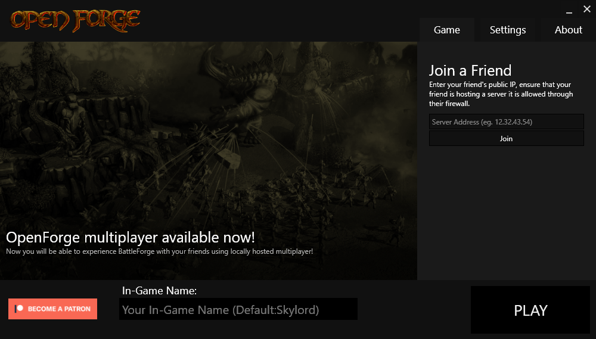
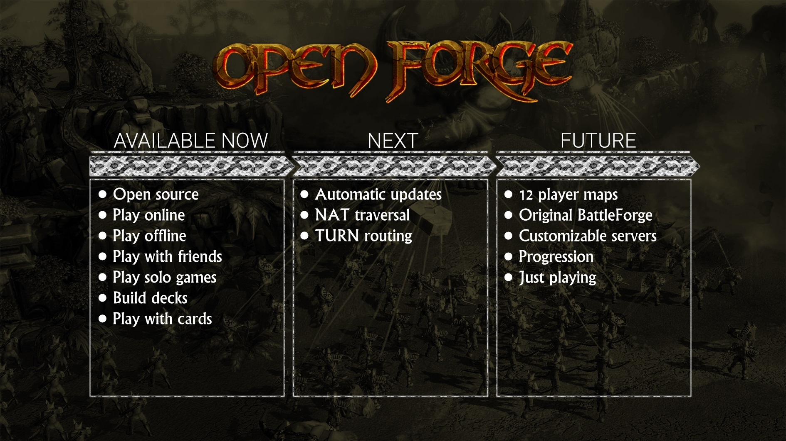

# OpenForge (Phase 2 out now!)

## Overview

The **OpenForge** project is an **open source** project that allows players to enter the Forge once again by making BattleForge available to play **offline** or **with friends**. Support us on [Patreon](https://www.patreon.com/openforge) to help us forge OpenForge together as a community.

In the future it will be possible to invite friends over the internet to join your session and play maps together.

The **OpenForge** project is not a private server.

Licensed under `GNU General Public License v3.0`.

## Getting Started

The **OpenForge** project is run by volunteer efforts from veteran and amateur developers.

* Follow the [Setting Up OpenForge Guide](#SettingUpOpenForge)
* Join [Discord](https://discord.com/invite/wXvshWrNPK) for real-time communication and collaboration.
* Check our [Issues](https://github.com/OpenForge/OpenForge/issues)
* Support us on [Patreon](https://www.patreon.com/openforge)

_______________________________________________________________________________________

# Setting Up OpenForge

## What You Need to Get Started

### Redistributables

The BattleForge client requires various redistributables to be installed. The following redistributables are known:

- http://download.microsoft.com/download/8/4/A/84A35BF1-DAFE-4AE8-82AF-AD2AE20B6B14/directx_Jun2010_redist.exe
- https://www.microsoft.com/en-us/download/details.aspx?id=40784
- https://www.microsoft.com/en-US/download/details.aspx?id=48145

### BattleForge client

- [Click here to download BattleForge client from Google Drive](https://drive.google.com/file/d/1W3W0WTCkpmnJn43afTwzKnoHukRs59D0/view)
- [Click here to download BattleForge client from MEGA](https://mega.nz/file/yI4y3ARD#ZwB5ziGg5W-ariNFxd25ptyn4D93Kj-J8ox3EJyh5xI)

### OpenForge Launcher

The OpenForge launcher can be downloaded from the [releases](https://github.com/OpenForgeBf/OpenForge/releases) page. 

_______________________________________________________________________________________

## Getting Started with OpenForge as a player

### Placing the Launcher

The launcher should be placed in the BattleForge directory such that `Battleforge.exe` and `OpenForgeLauncher.exe` are located in the same folder.

Alternatively the launcher can be placed anywhere and `Battleforge.exe` can be located using the **Find Battleforge.exe** button on the 

### Starting the Launcher

The next step is to start the launcher using `OpenForgeLauncher.exe` and that's it! You are ready to play!

### Play

Click the **Play** button to start BattleForge. Any credentials can be used to login.

Ports 7399 TCP and 7400 TCP should be forwarded on the router to be able to play together.
_______________________________________________________________________________________

## Getting Started with OpenForge as a developer

### Creating a GitHub Fork

The first step to getting started developing for OpenForge is to [create a fork](https://guides.github.com/activities/forking/) of the OpenForge repository on GitHub. This will create a copy of the repository to your GitHub account.

### Clone the Forked Repository

The second step, after you have created a fork, is to [clone the fork](https://guides.github.com/activities/forking/). Cloning will create a copy of the repository on your computer. Once you have completed this step, you should be able to navigate to the location on your computer where the repository resides and see the OpenForge project.
_______________________________________________________________________________________

## Roadmap

_______________________________________________________________________________________

## How to Contribute

Contributing to OpenForge is done through GitHub, using the Pull Request (PR) system.

Here is a simple [Guide to Submitting Pull Request](https://www.freecodecamp.org/news/how-to-make-your-first-pull-request-on-github-3/)

In the future, we will have a more defined process & workflow for certain types of content. However, for now here are some basic guidelines for pull requests:
* Reference an [Issue](https://github.com/OpenTournament/OpenTournament/issues) in every PR. Format should be OT-<IssueNumber>
* Try to make it easy to understand both the intent of your changes and the changes themselves.
* Limit Scope of PRs as much as possible

Unfortunately while there is extra effort on the developer side, this is needed in order to keep the PR and review process manageable!
_______________________________________________________________________________________
	
# Code and Asset Style Guide

Code and Asset style, formatting, and organization is an important task and is the responsibility of everyone contributing to the project. In order to ensure that your contributions are considered, please follow the following guidelines. If questions arise, defer to the conventions used in the OpenTournament project currently or decide upon & document new conventions.

* [Code Conventions](https://docs.microsoft.com/en-us/dotnet/csharp/programming-guide/inside-a-program/coding-conventions) - Please follow the Microsoft style guidelines for most code submissions, except where otherwise specified.
